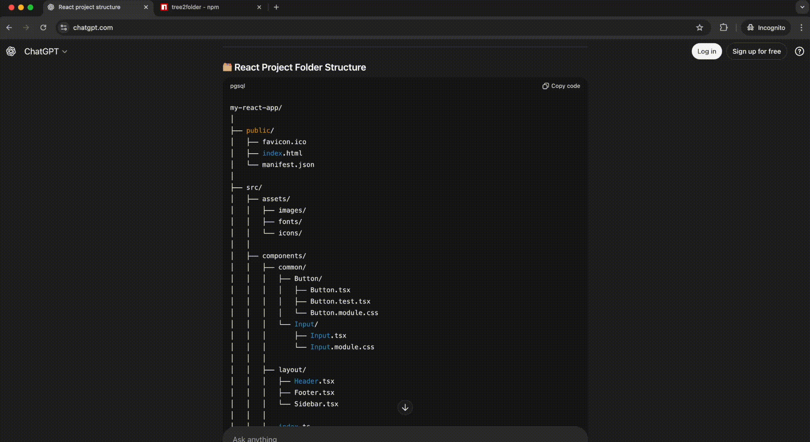

# tree2folder

Create files and folders from a simple ASCII tree diagram.

Demo
----

Watch how easy it is to create folder structures from ASCII diagrams using tree2folder!




Usage
-----

You can use tree2folder in two ways:

### Using npx (no installation required)

To run tree2folder without installing:

```bash
npx tree2folder <file-name> [<directory>]
```

- `<file-name>`: Path to the text file containing the directory tree diagram.
- `[<directory>]`: (Optional) Target directory where the structure will be created. Defaults to the current working directory.

### Global Installation

Install globally using npm:

```bash
npm install -g tree2folder
```

After installation, you can use it directly:

```bash
tree2folder <file-name> [<directory>]
```

Examples
--------

1) Basic example (create structure in current directory)

Create `diagram.txt` with this content:

```text
project
├─ bin/
│  └─ start.sh
├─ src/
│  ├─ index.js
│  └─ helpers.js
└─ README.md
```

Then run:

```bash
npx tree2folder diagram.txt
```

Result: a `project` folder containing the described files and folders.

2) Create into a specific directory

```bash
npx tree2folder diagram.txt ./output-folder
```

This creates the tree inside `./output-folder` (it will be created if it doesn't exist).

3) MVC application structure example

Create `mvc-app.txt` with this content:

```text
app
├─ controller/
│  └─ controller.php
├─ model/
│  └─ model.php
├─ view/
│  └─ view.php
├─ config/
│  └─ config.php
└─ public/
   └─ public.php
```

Then run:

```bash
npx tree2folder mvc-app.txt
```

Result: an `app` folder with a typical MVC directory structure containing separate folders for controllers, models, views, configuration, and public files.

4) Simple spaced indentation example

Create `simple-app.txt` with this content:

```text
app
    controller
        controller.php
    model
        model.php
    view
        view.php
    config
        config.php
    public
        public.php
```

Then run:

```bash
npx tree2folder simple-app.txt
```

Result: an `app` folder with the same MVC structure, demonstrating how simple spaced indentation works perfectly with tree2folder.


Supported input (exact)
-----------------------

Note: this version of `tree2folder` only supports the following ASCII-tree structure (the example below is the exact format the parser expects):

```text
project
├─ bin/
│  └─ start.sh
├─ src/
│  ├─ index.js
│  └─ helpers.js
└─ README.md
```

If your diagram uses a different style or additional decorations, convert it to the format above (same characters and indentation) and try again. Future versions may accept more varied input; contributions to broaden the parser are welcome.

4) Using stdin (pipe) — handy in scripts

```bash
cat diagram.txt | npx tree2folder -
```

Note: If the CLI supports `-` as a filename for stdin, the above will work; otherwise pass a filename. (Check CLI help in `bin/tree2folder.js` for exact stdin behavior.)

Behavior & tips
---------------

- Lines ending with `/` are treated as directories. Indentation (spaces) defines nesting.
- Tree characters like `├─`, `└─`, and `│` are ignored, so you can paste output from `tree` or similar utilities and it will still work.
- **Spacing**: Use consistent indentation with spaces (not tabs). Each level of nesting should use the same number of spaces (typically 2 or 4 spaces per level).
- Files are created empty by default. If a path already exists, behavior depends on the CLI implementation (it may skip, warn, or overwrite). Test in a temporary folder if you are unsure.

Contributing
------------

Contributions that improve examples, parser robustness, and helpful CLI flags are welcome.

Small ways to contribute:

- Add examples that show edge cases (spaces in names, many indent levels).
- Add a `--dry-run` flag to preview what will be created without making changes.
- Add `--force` to overwrite existing files and a `--yes` flag to skip prompts.
- Improve the README with platform-specific tips or CI-compatible examples.

License
-------

MIT — see the `LICENSE` file.
